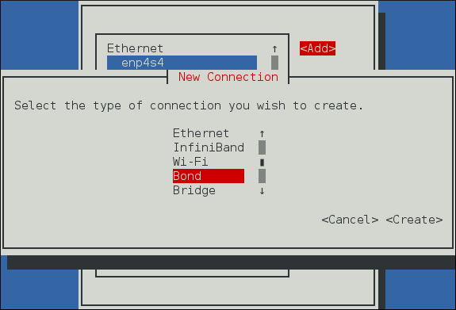
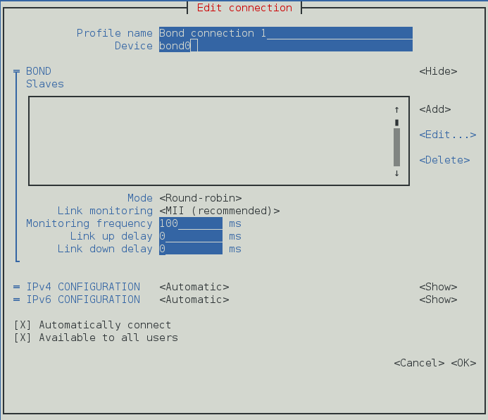
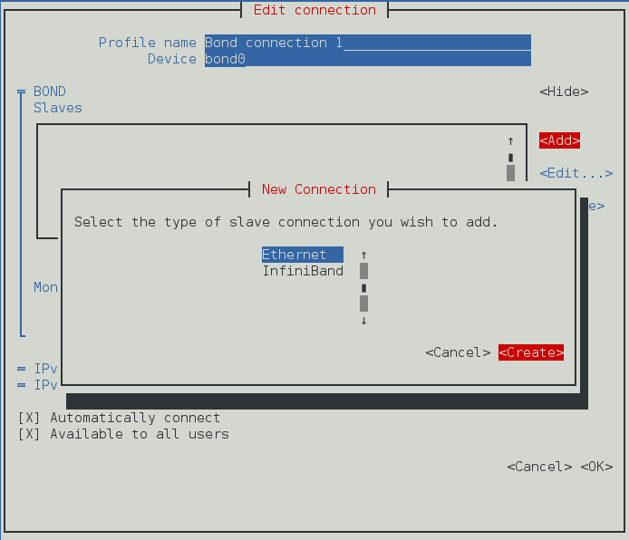
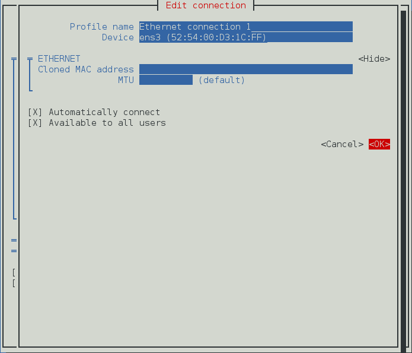
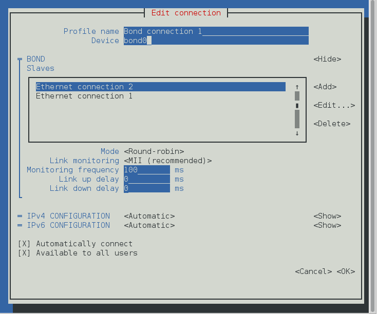

# Configure Network Bonding
Network Bonding allows administrators to bind multiple network interfaces together into a single, bonded, channel. Channel bonding enables two or more network interfaces to act as one, simultaneously increasing the bandwidth and providing redundancy.

📩The use of direct cable connections without network switches is not supported for bonding. The failover mechanisms described here will not work as expected without the presence of network switches.

## 1 Understanding the Default Behavior of Controller and Port Interfaces
  When controlling bonded port interfaces using the NetworkManager daemon, and especially when fault finding, keep the following in mind:
  - Starting the controller interface does not automatically start the port interfaces.
  - Starting a port interface always starts the controller interface.
  - Stopping the controller interface also stops the port interfaces.
  - A controller without ports can start static IP connections.
  - A controller without ports waits for ports when starting DHCP connections.
  - A controller with a DHCP connection waiting for ports completes when a port with a carrier is added.
  - A controller with a DHCP connection waiting for ports continues waiting when a port without a carrier is added.


## 2. Configure Bonding Using the Text User Interface, nmtui
The text user interface tool nmtui can be used to configure bonding in a terminal window. Issue the following command to start the tool:
```
 nmtui
```
📩 The text user interface appears. Any invalid command prints a usage message.

- From the starting menu, select Edit a connection. Select Add, the New Connection screen opens.
  
- Select Bond and then Create; the Edit connection screen for the bond will open.
  
- At this point port interfaces will need to be added to the bond; to add these select Add, the New Connection screen opens. Once the type of Connection has been chosen select the Create button.
  
- The port's Edit Connection display appears; enter the required port's device name or MAC address in the Device section. If required, enter a clone MAC address to be used as the bond's MAC address by selecting Show to the right of the Ethernet label. Select the OK button to save the port.
  
- The name of the bond port appears in the Slaves section. Repeat the above steps to add further port connections.
- Review and confirm the settings before selecting the OK button.
  

## 3. Network Bonding Using the NetworkManager Command Line Tool, nmcli

To create a bond connection with the nmcli tool, issue the following command:
  ```
  nmcli con add type bond ifname mybond0
  ```

Note that as no con-name was given for the bond, the connection name was derived from the interface name by prepending the type.

**NetworkManager** supports most of the bonding options provided by the kernel. For example:
  ```
    nmcli con add type bond ifname mybond0 bond.options "mode=balance-rr,miimon=100"
  ```

To add a port interface:
  - Create a new connection, see [“Creating and Modifying a Connection Profile with nmcli”](https://docs.redhat.com/en/documentation/red_hat_enterprise_linux/7/html/networking_guide/sec-Configuring_IP_Networking_with_nmcli#sec-Creating_and_Modifying_a_Connection_Profile_with_nmcli) for details.
  - Set the controller property to the bond interface name, or to the name of the controller connection:
    ```
    nmcli con add type ethernet ifname ens3 master mybond0
    Connection 'bond-slave-ens3' (220f99c6-ee0a-42a1-820e-454cbabc2618) successfully added.
    ```
    To add a new port interface, repeat the previous command with the new interface. For example:
    ```
    nmcli con add type ethernet ifname ens7 master mybond0
    Connection 'bond-slave-ens7' (ecc24c75-1c89-401f-90c8-9706531e0231) successfully added.
    ```

    To activate the ports, issue a command as follows:

    ```
    nmcli con up bond-slave-ens7
    Connection successfully activated (D-Bus active path: /org/freedesktop/NetworkManager/ActiveConnection/14)
    ```

    ```
    nmcli con up bond-slave-ens3
    Connection successfully activated (D-Bus active path: /org/freedesktop/NetworkManager/ActiveConnection/15)
    ```

    When you activate a port, the controller connection also starts. You can see, “Understanding the Default Behavior of Controller and Port Interfaces” for more information. In this case, it is not necessary to manually activate the controller connection.

    It is possible to change the active_slave option and the primary option of the bond at runtime, without deactivating the connection. For example to change the active_slave option, issue the following command:

    ```
    nmcli dev mod bond0 +bond.options "active_slave=ens7"
    Connection successfully reapplied to device 'bond0'.
    ```

    or to change the primary option:

    ```
    nmcli dev mod bond0 +bond.options "primary=ens3"
    Connection successfully reapplied to device 'bond0'.
    ```

    📩 The active_slave option sets the currently active port whereas the primary option of the bond specifies the active port to be automatically selected by kernel when a new port is added or a failure of the active port occurs.

## 4.  Verifying Network Configuration Bonding for Redundancy

Network redundancy is a process when devices are used for backup purposes to prevent or recover from a failure of a specific system. The following procedure describes how to verify the network configuration for bonding in redundancy:

1. Ping the destination IP from the bond interface. For example:
   ```
   ping -I bond0 DSTADDR
   ```
2. View which interface is in active mode:
   ```
   cat /sys/class/net/bond0/bonding/active_slave
   ```
   enp1s0 is the active port interface.
   
3. Set the active port interface down:
   ```
   ip link set enp1s0 down
   ```
4. Check if the backup interface is up:
   ```
   cat /sys/class/net/bond0/bonding/active_slave
   ```
   enp2s0 is now the active port interface.
   
5. Check if you can still ping the destination IP from the bond interface:
    ```
   ping -I bond0 DSTADDR
   ```

## 5. Overview of Bonding Modes and the Required Settings on the Switch

The following table describes the required configuration that you must apply to the upstream switch depending on the bonding mode:

***Table 5.1. Switch Configuration Settings Depending on the Bonding Modes***

|     |  Bonding Mode   |  Configuration on the Switch                                 |
| :--- |      :---        |                          :-----                               |
|  0  |  balance-rr     |  Requires static Etherchannel enabled (not LACP-negotiated)  |
|  1  |  active-backup  |  Requires autonomous ports                                   |
|  2  |  balance-xor    |  Requires static Etherchannel enabled (not LACP-negotiated)  |
|  3  |  broadcast      |  Requires static Etherchannel enabled (not LACP-negotiated)  |
|  4  |  802.3ad        |  Requires LACP-negotiated Etherchannel enabled               |
|  5  |  balance-tlb    |  Requires autonomous ports                                   |
|  6  |  balance-alb    |  Requires autonomous ports                                   |

📩 For configuring these settings on your switch, see the switch documentation.


