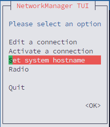
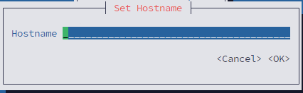

# 1. Configuring Host Names Using Text User Interface, nmtui

The text user interface tool nmtui can be used to configure a host name in a terminal window. Issue the following command to start the tool:

  ```
  nmtui
  ```
The text user interface appears. Any invalid command prints a usage message.



*Fig1.1 The NetworkManager Text User Interface starting menu*

then Give the HostName and click ok button. This will set the hostname as static hostname in the /etc/hostname file.

.

*Fig1.2 Tive host Name of your server*

# 2.Configuring Host Names Using hostnamectl

  The hostnamectl tool is provided for administering the three separate classes of host names in use on a given system.
  ## 2.1  View All the Host Names
  To view all the current host names, enter the following command:
    
    
    hostnamectl status
    
      
  The status option is implied by default if no option is given.
    
  ## 2.2  Set All the Host Names
  To set all the host names on a system, enter the following command as root:
    
    
      hostnamectl set-hostname name
    
      
  This will alter the pretty, static, and transient host names alike. The static and transient host names will be simplified forms of the pretty host name. Spaces will be replaced with “-” and special characters will be removed.

  ## 2.3 Set a Particular Host Name
  To set a particular host name, enter the following command as root with the relevant option:

    
      hostnamectl set-hostname name [option...]
    
  Where option is one or more of: --pretty, --static, and --transient.
    
  If the --static or --transient options are used together with the --pretty option, the static and transient host names will be simplified forms of the pretty host name. Spaces will be replaced with “-” and special characters will be removed. 
  If the --pretty option is not given, no simplification takes place.
    
  When setting a pretty host name, remember to use the appropriate quotation marks if the host name contains spaces or a single quotation mark. For example:
    
    
      hostnamectl set-hostname "Stephen's notebook" --pretty
    
    

  ### 2.3.1  Static Hostname
  - Definition: The system's persistent hostname, stored in /etc/hostname.
  - Survives reboot ✔️
  - Used by default for network identification, system logs, shell prompts, etc.
  - Set by:
    ```
    sudo hostnamectl set-hostname myhost
    ```
  ### 2.3.2  Pretty Hostname
  - Definition: A descriptive, human-friendly name (with spaces and special characters).
  - Does not affect networking or DNS.
  - Often used by GUI environments (GNOME, etc.).
  - Set by:
    ```
    sudo hostnamectl set-hostname "My Pretty Laptop" --pretty
    ```

   ### 2.3.3  Transient Hostname
  - Definition: A temporary hostname assigned at runtime (e.g., by DHCP, mDNS, or systemd).
  - Does not survive reboot ❌.
  - Set manually or by services like dhclient.
  - Set by:
    ```
    sudo hostnamectl set-hostname temp-name --transient
    ```
  
 

  ## 2.3 Clear a Particular Host Name
  
  To clear a particular host name and allow it to revert to the default, enter the following command as root with the relevant option:

      hostnamectl set-hostname "" [option...]

  ✉️ Where "" is a quoted empty string and where option is one or more of: --pretty, --static, and --transient.

  ## 2.4  Changing Host Names Remotely

  To execute a hostnamectl command on a remote system, use the -H, --host option as follows:

    hostnamectl set-hostname -H [username]@hostname

  Where hostname is the remote host you want to configure. The username is optional. The hostnamectl tool will use SSH to connect to the remote system.


  # 3. Configuring Host Names Using nmcli

  The NetworkManager tool nmcli can be used to query and set the static host name in the **/etc/hostname** file.

  To query the static host name, issue the following command:

    
      nmcli general hostname
    
    
  To set the static host name to my-server, issue the following command as root:
  
    
      nmcli general hostname my-server
    
  
    

    
