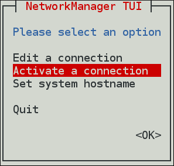

# A Summary of NetworkManager Tools and Applications

| Application or Tool | Description |
| --- | --- |
| `nmcli ` |A command-line tool which enables users and scripts to interact with **NetworkManager**. Note that nmcli can be used on systems without a GUI such as servers to control all aspects of **NetworkManager**. It has the same functionality as GUI tools. |
| `nmtui ` | A simple curses-based text user interface (TUI) for **NetworkManager** |
|`nm-connection-editor`|A graphical user interface tool for certain tasks not yet handled by the control-center utility such as configuring bonds and teaming connections. You can add, remove, and modify network connections stored by **NetworkManager**. To start it, enter nm-connection-editor in a terminal: ``` nm-connection-editor ``` |
|`control-center`|A graphical user interface tool provided by the GNOME Shell, available for desktop users. It incorporates a Network settings tool. To start it, press the Super key to enter the Activities Overview, type Network and then press Enter. The Network settings tool appears.|
|`network connection icon`|A graphical user interface tool provided by the GNOME Shell representing network connection states as reported by NetworkManager. The icon has multiple states that serve as visual indicators for the type of connection you are currently using.|

# Configuring IP Networking
## 1. Selecting Network Configuration Methods
 + To configure a network interface using NetworkManager, use one of the following tools:
    1. the text user interface tool, nmtui
    2. the command-line tool, nmcli.
    3. the graphical user interface tools, GNOME GUI.

+ To Configure a network interface without using NetworkManager:
   1. edit the ifcfg files manually.
   2. use the ip commands. This can be used to assign IP addresses to an interface, but changes are not persistent across reboots; when you reboot, you will lose any changes.
+ To configure the network settings when the root filesystem is not local:
  1. use the kernel command-line.
## 2. Configuring IP Networking with nmtui

As a system administrator, you can configure a network interface using the NetworkManager's tool, nmtui.

**This procedure describes how to configure networking using the text user interface tool, nmtui.**
- The nmtui tool is used in a terminal window. It is contained in the NetworkManager-tui package, but it is not installed along with NetworkManager by default. To install NetworkManager-tui:
  ```
   yum/dnf/apt install NetworkManager-tui
  ```
  - To verify that NetworkManager is running,
    
    I. Start the nmtui tool:
  ```
     nmtui
  ```
  The text user interface appears.
  
  
  
    II. To navigate, use the arrow keys or press Tab to step forwards and press Shift+Tab to step back through the options. Press Enter to select an option. The Space bar toggles the status of a check box.

  - To apply changes after a modified connection which is already active requires a reactivation of the connection. In this case, follow the procedure below:
    1. Select the Activate a connection menu entry.
        
       
       
    2. Select the modified connection. On the right, click the Deactivate button.
     
       
       
    3. Choose the connection again and click the Activate button.
       
       

### The following commands are also available:

  ```
     nmtui edit connection-name
  ```

> If no connection name is supplied, the selection menu appears. If the connection name is supplied and correctly identified, the relevant Edit connection screen appears.

 ```
     nmtui connect connection-name
  ```
> If no connection name is supplied, the selection menu appears. If the connection name is supplied and correctly identified, the relevant connection is activated. Any invalid command prints a usage message.

>[!Note] 🎶 Note that nmtui does not support all types of connections. In particular, you cannot edit VPNs, wireless network connections using WPA Enterprise, or Ethernet connections using 802.1X.

## 3. Configuring IP Networking with nmcli

The nmcli (NetworkManager Command Line Interface) command-line utility is used for controlling NetworkManager and reporting network status.nmcli is used to create, display, edit, delete, activate, and deactivate network connections, as well as control and display network device status.

The nmcli utility can be used by both users and scripts for controlling NetworkManager:

- For servers, headless machines, and terminals, nmcli can be used to control NetworkManager directly, without GUI, including creating, editing, starting and stopping network connections and viewing network status.
- For scripts, nmcli supports a terse output format which is better suited for script processing. It is a way to integrate network configuration instead of managing network connections manually.

  ***Some of useful optional OPTIONS to get started are:***
  - -t, terse: Viewing a terse output
   
   ```
    nmcli -t device
  ```

  -  field,-f : This option specifies what fields can be displayed in output. For example, NAME,UUID,TYPE,AUTOCONNECT,ACTIVE,DEVICE,STATE. You can use one or more fields. If you want to use more, do not use space after comma to separate the fields.

      + Specifying Fields in the output

     ```
     nmcli -f DEVICE,TYPE device
     ```
      or even better for scripting:
     
    
     
     nmcli -t -f DEVICE,TYPE device
     

 -  pretty, -p : This option causes nmcli to produce human-readable output. For example, values are aligned and headers are printed.

  ```
   nmcli -p device
  ```

### Brief Selection of nmcli Examples

-  Checking the overall status of NetworkManager
```
nmcli general status
```
- In terse mode:
```
 nmcli -t -f STATE general
```
- Viewing NetworkManager logging status
```
 nmcli general logging
```
- Viewing all connections
```
nmcli connection show
```
-  Viewing only currently active connections
```
nmcli connection show --active
```
- Viewing only devices recognized by NetworkManager and their state
```
nmcli device status
```
- You can also use the following abbreviations of the nmcli commands:
  
| nmcli command  | abbreviation |
| ------------- | ------------- |
| nmcli general status  | 	nmcli g  |
| nmcli general logging | nmcli g log  |
| nmcli connection show | nmcli con show |
| nmcli device status | 	nmcli dev |
| nmcli connection show --active | nmcli con show -a |

### The nmcli tool can be used to start and stop any network interface, including controllers. For example:
```
nmcli con up id bond0
nmcli con up id port0
nmcli dev disconnect bond0
nmcli dev disconnect ens3
```
### Understanding the nmcli Options

Following are some of the important nmcli property options. See the comprehensive list in the nmcli(1) man page :

**connection.type:**
A connection type. Allowed values are: adsl, bond, bond-slave, bridge, bridge-slave, bluetooth, cdma, ethernet, gsm, infiniband, olpc-mesh, team, team-slave, vlan, wifi, wimax. Each connection type has type-specific command options. You can see the TYPE_SPECIFIC_OPTIONS list in the nmcli(1) man page. For example:
- A **gsm** connection requires the access point name specified in an **apn**.
```
nmcli c add connection.type gsm apn access_point_name
```
- A **wifi** device requires the service set identifier specified in a **ssid**.
```
nmcli c add connection.type wifi ssid My identifier
```
***connection.interface-name***
- A device name relevant for the connection.
```
nmcli con add connection.interface-name enp1s0 type ethernet
```
***connection.id***
A name used for the connection profile. If you do not specify a connection name, one will be generated as follows:
```
connection.type -connection.interface-name
```
> The connection.id is the name of a connection profile and should not be confused with the interface name which denotes a device (wlp61s0, ens3, em1). However, users can name the connections after interfaces, but they are not the same thing. There can be multiple connection profiles available for a device. This is particularly useful for mobile devices or when switching a network cable back and forth between different devices. Rather than edit the configuration, create different profiles and apply them to the interface as needed. The id option also refers to the connection profile name.

📖 NOTE: The most important options for nmcli commands such as show, up, down are:

**id**

An identification string assigned by the user to a connection profile. Id can be used in nmcli connection commands to identify a connection. The NAME field in the command output always denotes the connection id. It refers to the same connection profile name that the con-name does.

**uuid**

A unique identification string assigned by the system to a connection profile. The uuid can be used in nmcli connection commands to identify a connection.

### Using the nmcli Interactive Connection Editor
The **nmcli** tool has an interactive connection editor. To use it:

```
nmcli con edit
```
The format is as follows for editing an existing connection profile:
```
nmcli con edit [id | uuid | path] ID
```
For editing a new connection profile:

```
nmcli con edit [type new-connection-type] [con-name new-connection-name]
```
### Creating and Modifying a Connection Profile with nmcli

A connection profile contains the connection property information needed to connect to a data source.
To create a new profile for NetworkManager using nmcli:

```
nmcli c add {ARGUMENTS}
```

The nmcli c add accepts two different types of parameters:
**Property names**
the names which NetworkManager uses to describe the connection internally. The most important are:
- connection.type
  ```
    nmcli c add connection.type bond
  ```
- connection.interface-name
  ```
   nmcli c add connection.interface-name enp1s0
  ```
- connection.id
  ```
   nmcli c add connection.id "My Connection"
  ```

In more recent versions, both the property names and the aliases can be used interchangeably. The following examples are all valid and equivalent:

  ```
    nmcli c add type ethernet ifname enp1s0 con-name "My Connection" ethernet.mtu 1600
  ```

  ```
    nmcli c add connection.type ethernet ifname enp1s0 con-name "My Connection" ethernet.mtu 1600 
  ```
  > The arguments differ according to the connection types. Only the type argument is mandatory for all connection types and ifname is mandatory for all types except bond, team, bridge and vlan.
***To modify one or more properties of a connection profile, use the following command:***
```
  nmcli c modify
```
> It is preferable to use the property names. The aliases are used only for compatibility reasons.

In addition, to set the ethernet MTU to 1600, modify the size as follows:
```
nmcli c modify "My favorite connection" ethernet.mtu 1600
```

To apply changes after a modified connection using nmcli, activate again the connection by entering this command:
```
nmcli con up con-name
```
For example:

```
nmcli con up My-favorite-connection
```


## Connecting to a Network Using nmcli

To list the currently available network connections:
```
nmcli con show
```
> Note that the NAME field in the output always denotes the connection ID (name). It is not the interface name even though it might look the same.

If it's DHCP-based (which is most common):
```
nmcli device connect enp1s0

```
Or, bring up an existing connection profile:

```
nmcli con up id "MyEthernet"

```
### Adding and Configuring a Dynamic Ethernet Connection with nmcli

Adding a Dynamic Ethernet Connection

To add an Ethernet configuration profile with dynamic IP configuration, allowing DHCP to assign the network configuration:
```
nmcli connection add type ethernet con-name connection-name ifname interface-name
```

For example, to create a dynamic connection profile named my-office:

```
nmcli con add type ethernet con-name my-office ifname ens3
```

To open the Ethernet connection:

```
nmcli con up my-office
```

**Configuring a Dynamic Ethernet Connection***

To change the host name sent by a host to a DHCP server, modify the dhcp-hostname property:

```
nmcli con modify my-office my-office ipv4.dhcp-hostname host-name ipv6.dhcp-hostname host-name
```

To change the IPv4 client ID sent by a host to a DHCP server, modify the dhcp-client-id property:
```
 nmcli con modify my-office my-office ipv4.dhcp-client-id client-ID-string
```
There is no dhcp-client-id property for IPv6, dhclient creates an identifier for IPv6. See the dhclient(8) man page for details.


To ignore the DNS servers sent to a host by a DHCP server, modify the ignore-auto-dns property:

```
 nmcli con modify my-office my-office ipv4.ignore-auto-dns yes ipv6.ignore-auto-dns yes

```

***Configuring a Dynamic Ethernet Connection Using the Interactive Editor**

To configure a dynamic Ethernet connection using the interactive editor:

```
~]$ nmcli con edit type ethernet con-name ens3

===| nmcli interactive connection editor |===

Adding a new '802-3-ethernet' connection

Type 'help' or '?' for available commands.
Type 'describe [<setting>.<prop>]' for detailed property description.

You may edit the following settings: connection, 802-3-ethernet (ethernet), 802-1x, ipv4, ipv6, dcb
nmcli> describe ipv4.method

=== [method] ===
[NM property description]
IPv4 configuration method.  If 'auto' is specified then the appropriate automatic method (DHCP, PPP, etc) is used for the interface and most other properties can be left unset.  If 'link-local' is specified, then a link-local address in the 169.254/16 range will be assigned to the interface.  If 'manual' is specified, static IP addressing is used and at least one IP address must be given in the 'addresses' property.  If 'shared' is specified (indicating that this connection will provide network access to other computers) then the interface is assigned an address in the 10.42.x.1/24 range and a DHCP and forwarding DNS server are started, and the interface is NAT-ed to the current default network connection.  'disabled' means IPv4 will not be used on this connection.  This property must be set.

nmcli> set ipv4.method auto
nmcli> save
Saving the connection with 'autoconnect=yes'. That might result in an immediate activation of the connection.
Do you still want to save? [yes] yes
Connection 'ens3' (090b61f7-540f-4dd6-bf1f-a905831fc287) successfully saved.
nmcli> quit
~]$
```
> The default action is to save the connection profile as persistent. If required, the profile can be held in memory only, until the next restart, by means of the save temporary command.

### Adding and Configuring a Static Ethernet Connection with nmcli

**Adding a Static Ethernet Connection**

To add an Ethernet connection with static IPv4 configuration:

```
nmcli connection add type ethernet con-name connection-name ifname interface-name ip4 address gw4 address
```
> IPv6 address and gateway information can be added using the ip6 and gw6 options.

For example, to create a static Ethernet connection with only IPv4 address and gateway:
```
nmcli con add type ethernet con-name test-lab ifname ens9 ip4 10.10.10.10/24 \
gw4 10.10.10.254
```

Optionally, at the same time specify IPv6 address and gateway for the device:

```
nmcli con add type ethernet con-name test-lab ifname ens9 ip4 10.10.10.10/24 \
gw4 10.10.10.254 ip6 abbe::cafe gw6 2001:db8::1
```
**To set two IPv4 DNS server addresses:**

```
nmcli con mod test-lab ipv4.dns "8.8.8.8 8.8.4.4"
```
> 📖 Note that this will replace any previously set DNS servers.
> 
**To set two IPv6 DNS server addresses:** 

```
nmcli con mod test-lab ipv6.dns "2001:4860:4860::8888 2001:4860:4860::8844"
```
📖Note that this will replace any previously set DNS servers. 

**Alternatively, to add additional DNS servers to any previously set, use the + prefix:**

```
nmcli con mod test-lab +ipv4.dns "8.8.8.8 8.8.4.4"
```

```
nmcli con mod test-lab +ipv6.dns "2001:4860:4860::8888 2001:4860:4860::8844"
```

To open the new Ethernet connection:

```
 nmcli con up test-lab ifname ens9
```

**To view detailed information about the newly configured connection, issue a command as follows:**
```
nmcli -p con show test-lab
```

**Configuring a Static Ethernet Connection Using the Interactive Editor**

To configure a static Ethernet connection using the interactive editor:
```
nmcli con edit type ethernet con-name ens3

===| nmcli interactive connection editor |===

Adding a new '802-3-ethernet' connection

Type 'help' or '?' for available commands.
Type 'describe [>setting<.>prop<]' for detailed property description.

You may edit the following settings: connection, 802-3-ethernet (ethernet), 802-1x, ipv4, ipv6, dcb
nmcli> set ipv4.addresses 192.168.122.88/24
Do you also want to set 'ipv4.method' to 'manual'? [yes]: yes
nmcli>
nmcli> save temporary
Saving the connection with 'autoconnect=yes'. That might result in an immediate activation of the connection.
Do you still want to save? [yes] no
nmcli> save
Saving the connection with 'autoconnect=yes'. That might result in an immediate activation of the connection.
Do you still want to save? [yes] yes
Connection 'ens3' (704a5666-8cbd-4d89-b5f9-fa65a3dbc916) successfully saved.
nmcli> quit
```

The default action is to save the connection profile as persistent. If required, the profile can be held in memory only, until the next restart, by means of the save temporary command.

📖NetworkManager will set its internal parameter connection.autoconnect to yes. NetworkManager will also write out settings to /etc/sysconfig/network-scripts/ifcfg-my-office where the corresponding BOOTPROTO will be set to none and ONBOOT to yes.

### Locking a Profile to a Specific Device Using nmcli

To lock a profile to a specific interface device:
```
nmcli connection add type ethernet con-name connection-name ifname interface-name
```
To make a profile usable for all compatible Ethernet interfaces:

```
nmcli connection add type ethernet con-name connection-name ifname "*"
```
📖 Note that you have to use the ifname argument even if you do not want to set a specific interface. Use the wildcard character * to specify that the profile can be used with any compatible device.

**To lock a profile to a specific MAC address:**

```
nmcli connection add type ethernet con-name "connection-name" ifname "*" mac 00:00:5E:00:53:00
```

### Adding a Wi-Fi Connection with nmcli

To view the available Wi-Fi access points:
```
nmcli dev wifi lis
```
To create a Wi-Fi connection profile with static IP configuration, but allowing automatic DNS address assignment:
```
 nmcli con add con-name MyCafe ifname wlp61s0 type wifi ssid MyCafe \
ip4 192.168.100.101/24 gw4 192.168.100.1
```

To set a WPA2 password, for example “caffeine”:
```
nmcli con modify MyCafe wifi-sec.key-mgmt wpa-psk
nmcli con modify MyCafe wifi-sec.psk caffeine
```
To change Wi-Fi state:
```
nmcli radio wifi [on | off ]
```
**Changing a Specific Property Using nmcli**

To check a specific property, for example mtu:
```
 nmcli connection show id 'MyCafe' | grep mtu
802-11-wireless.mtu:                     auto
```

To change the property of a setting:

```
 nmcli connection modify id 'MyCafe' 802-11-wireless.mtu 1350
```
📖Note that NetworkManager refers to parameters such as 802-3-ethernet and 802-11-wireless as the setting, and mtu as a property of the setting.

### Configuring NetworkManager to Ignore Certain Devices
By default, NetworkManager manages all devices except the lo (loopback) device. However, you can set certain devices as unmanaged to configure that NetworkManager ignores these devices. With this setting, you can manually manage these devices, for example, using a script.

1. Permanently Configuring a Device as Unmanaged in NetworkManager
   You can configure devices as unmanaged based on several criteria, such as the interface name, MAC address, or device type. This procedure describes how to permanently set the enp1s0 interface as unmanaged in NetworkManager.
   Procedure
   - Optional: Display the list of devices to identify the device you want to set as unmanaged:
     ```
     nmcli device status
     ```
   - Create the /etc/NetworkManager/conf.d/99-unmanaged-devices.conf file with the following content:
     ```
      [keyfile]
     unmanaged-devices=interface-name:enp1s0
     ```
      To set multiple devices as unmanaged, separate the entries in the unmanaged-devices parameter with semicolon:
     ```
     [keyfile]
     unmanaged-devices=interface-name:interface_1;interface-name:interface_2;...
     ```
   - Reload the NetworkManager service:
     ```
      systemctl reload NetworkManager
     ```
    Verification Steps
   
      Display the list of devices:
   
         
          nmcli device status
          DEVICE  TYPE      STATE      CONNECTION
          enp1s0  ethernet  unmanaged  --
         

     📖 The unmanaged state next to the enp1s0 device indicates that NetworkManager does not manage this device.
   
2. Temporarily Configuring a Device as Unmanaged in NetworkManager

   You can configure devices as unmanaged based on several criteria, such as the interface name, MAC address, or device type. This procedure describes how to temporarily set the enp1s0 interface as unmanaged in NetworkManager.
   Procedure
      - Optional: Display the list of devices to identify the device you want to set as unmanaged:
        ```
        nmcli device status
        ```
      - Set the enp1s0 device to the unmanaged state:
        ```
        nmcli device set enp1s0 managed no
        ```
      Verification Steps
      - Display the list of devices:
        ```
        nmcli device status
        ```
   The unmanaged state next to the enp1s0 device indicates that NetworkManager does not manage this device.
   
Additional Resources

For a list of criteria you can use to configure devices as unmanaged and the corresponding syntax,

