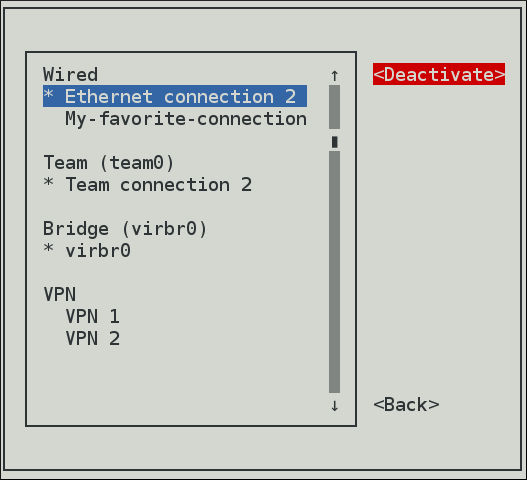

# A Summary of NetworkManager Tools and Applications

| Application or Tool | Description |
| --- | --- |
| `nmcli ` |A command-line tool which enables users and scripts to interact with **NetworkManager**. Note that nmcli can be used on systems without a GUI such as servers to control all aspects of **NetworkManager**. It has the same functionality as GUI tools. |
| `nmtui ` | A simple curses-based text user interface (TUI) for **NetworkManager** |
|`nm-connection-editor`|A graphical user interface tool for certain tasks not yet handled by the control-center utility such as configuring bonds and teaming connections. You can add, remove, and modify network connections stored by **NetworkManager**. To start it, enter nm-connection-editor in a terminal: ``` nm-connection-editor ``` |
|`control-center`|A graphical user interface tool provided by the GNOME Shell, available for desktop users. It incorporates a Network settings tool. To start it, press the Super key to enter the Activities Overview, type Network and then press Enter. The Network settings tool appears.|
|`network connection icon`|A graphical user interface tool provided by the GNOME Shell representing network connection states as reported by NetworkManager. The icon has multiple states that serve as visual indicators for the type of connection you are currently using.|

# Configuring IP Networking
## 1. Selecting Network Configuration Methods
 + To configure a network interface using NetworkManager, use one of the following tools:
    1. the text user interface tool, nmtui
    2. the command-line tool, nmcli.
    3. the graphical user interface tools, GNOME GUI.

+ To Configure a network interface without using NetworkManager:
   1. edit the ifcfg files manually.
   2. use the ip commands. This can be used to assign IP addresses to an interface, but changes are not persistent across reboots; when you reboot, you will lose any changes.
+ To configure the network settings when the root filesystem is not local:
  1. use the kernel command-line.
## 2. Configuring IP Networking with nmtui

As a system administrator, you can configure a network interface using the NetworkManager's tool, nmtui.

**This procedure describes how to configure networking using the text user interface tool, nmtui.**
- The nmtui tool is used in a terminal window. It is contained in the NetworkManager-tui package, but it is not installed along with NetworkManager by default. To install NetworkManager-tui:
  ```
   yum/dnf/apt install NetworkManager-tui
  ```
  - To verify that NetworkManager is running,
    
    I. Start the nmtui tool:
  ```
     nmtui
  ```
  The text user interface appears.
  
  
  
    II. To navigate, use the arrow keys or press Tab to step forwards and press Shift+Tab to step back through the options. Press Enter to select an option. The Space bar toggles the status of a check box.

  - To apply changes after a modified connection which is already active requires a reactivation of the connection. In this case, follow the procedure below:
    1. Select the Activate a connection menu entry.
        
       
       
    2. Select the modified connection. On the right, click the Deactivate button.
     
       
       
    3. Choose the connection again and click the Activate button.
       
       

### The following commands are also available:

  ```
     nmtui edit connection-name
  ```

> If no connection name is supplied, the selection menu appears. If the connection name is supplied and correctly identified, the relevant Edit connection screen appears.

 ```
     nmtui connect connection-name
  ```
> If no connection name is supplied, the selection menu appears. If the connection name is supplied and correctly identified, the relevant connection is activated. Any invalid command prints a usage message.

>[!Note] 🎶 Note that nmtui does not support all types of connections. In particular, you cannot edit VPNs, wireless network connections using WPA Enterprise, or Ethernet connections using 802.1X.

## 3. Configuring IP Networking with nmcli
